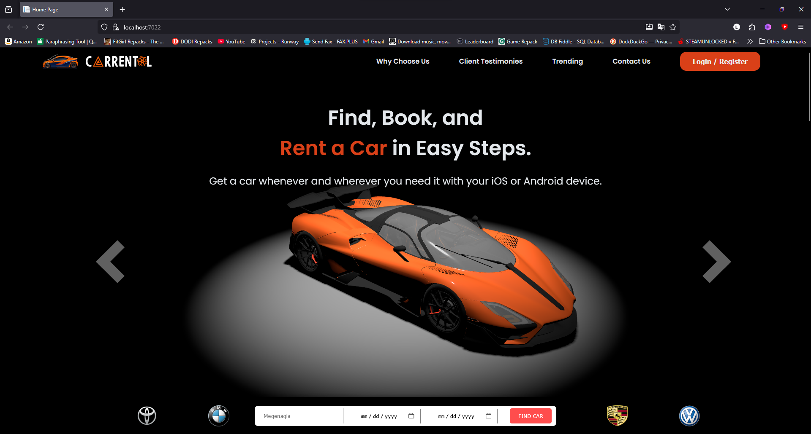

<div align="center">

# 🚗 CarRental 5.0 — ASP.NET Core MVC + Three.js

[](https://github.com/LeulTew/CarRental-ThreeJS-MVC/actions)
[](https://dotnet.microsoft.com/)
[](LICENSE)
[](https://github.com/LeulTew/CarRental-ThreeJS-MVC)

**Fast, full-stack car rental platform** with an interactive Three.js landing page (no React), robust MVC backend, and PayPal sandbox payments. Experience cutting-edge web development in action!



[📥 **Download Demo Video**](docs/assets/Carrentaldemo.mp4) | [📖 **Live App**](https://localhost:7022/) | [🐛 **Report Issue**](https://github.com/LeulTew/CarRental-ThreeJS-MVC/issues)

</div>

---

## 📋 Table of Contents
- [✨ Overview](#-overview)
- [🎬 Demo & Screenshots](#-demo--screenshots)
- [🚀 Features](#-features)
- [🏗️ Architecture](#️-architecture)
- [🛠️ Tech Stack](#️-tech-stack)
- [⚡ Quick Start](#-quick-start)
- [🔧 Configuration](#-configuration)
- [🗄️ Data & Migrations](#️-data--migrations)
- [🛣️ API Routes](#️-api-routes)
- [⚡ Performance Notes](#-performance-notes)
- [🧹 Repository Hygiene](#-repository-hygiene)
- [🏆 Resume Highlights](#-resume-highlights)

---

## ✨ Overview

Welcome to **CarRental 5.0**, a showcase of modern web development excellence! This project delivers a complete car rental experience with:

- **🎨 Immersive Landing**: Pure Three.js with GLTF models for stunning visuals and lightning-fast load times (no React overhead).
- **🔧 Robust Backend**: ASP.NET Core MVC with Entity Framework, authentication, payments, and email integration.
- **💳 Payment Integration**: Secure PayPal sandbox transactions with currency conversion.
- **🔍 Advanced Filtering**: Multi-criteria search, favorites, reviews, and role-based management.

### 🗂️ Project Structure
```
Carrental/
├── Controllers/          # MVC Controllers (Home, Car, Account, etc.)
├── Models/               # Domain entities & ViewModels
├── Views/                # Razor templates
├── Services/             # Business logic (Payments, Email)
├── wwwroot/              # Static assets (Three.js, GLTF models)
├── Migrations/           # EF Core migrations
└── Program.cs            # App startup & configuration
```

**Key Files for Orientation:**
- **Landing Page**: `Views/Home/Index.cshtml` + `wwwroot/Home/assets/js/main.js`
- **3D Assets**: `wwwroot/car1..car4/` (GLTF models)
- **Payments**: `Services/PaypalServices.cs`
- **Database**: `Models/CarContext.cs` (sample data: `db/CarR.bacpac`)

---

## 🎬 Demo & Screenshots

Dive into the action with our interactive demo and key app screens!

### 🎥 Demo Video
[📥 **Download & Play Demo Video**](docs/assets/Carrentaldemo.mp4)  
*Download the MP4 file and play it locally to see the Three.js landing, catalog browsing, booking flow, and payments in action!*

### 📸 Key Screenshots

| Feature | Description | File Path |
|---------|-------------|-----------|
| 🏠 **Home (Three.js Landing)** | Interactive 3D model viewer with navigation | `Views/Home/Index.cshtml` |
| 📋 **Catalog & Filters** | Advanced search with make/model, price, availability | `/Car` |
| 💳 **Payment Screen** | PayPal checkout with booking summary | `Views/Car/ProcessPayment.cshtml` |

### 🖼️ Screenshots Gallery
*Add your own screenshots to `docs/screens/` and update paths below:*
- **Landing Page**: `docs/screens/landing.png`
- **Catalog View**: `docs/screens/catalog.png`
- **Details/Booking**: `docs/screens/details.png`
- **Payment Flow**: `docs/screens/payment.png`

**📥 Download Demo Video**: [docs/assets/Carrentaldemo.mp4](docs/assets/Carrentaldemo.mp4)

---

## 🚀 Features

### 🎨 Frontend Highlights
- **Three.js Landing Page**: GLTF model loading with OrbitControls, responsive scaling, and arrow navigation
- **Responsive Design**: Mobile-friendly UI with vanilla JS/CSS and Swiper for galleries

### 🔧 Backend Powerhouse
- **Advanced Filtering**: Make, Model, Type, Color, Price Range, Availability, Favorites, Sorting
- **Car Management**: Gallery, versions (for sale), reviews, favorites toggle
- **Booking System**: Date conflict checks, total calculations, completion tracking
- **Payment Processing**: PayPal sandbox with redirect/return flow and ETB→USD conversion

### 🔐 Security & Auth
- **ASP.NET Identity**: User registration, login, roles (Admin, Manager, Provider, Customer)
- **Google OAuth**: External login integration
- **Email Notifications**: Confirmation and forgot-password via SMTP with HTML templates

### 🎤 Extra Features
- **Favorites**: Many-to-many user-car relationships
- **Speech-to-Text**: Google Cloud Speech API endpoint for voice inputs
- **Role-Based Access**: Granular permissions for different user types

---

## 🏗️ Architecture

### 🗺️ Module Map
```
HTTP Request
    ↓
Controller (Home/Car/Account)
    ↓
Repository / DbContext
    ↓
Domain Models → ViewModels
    ↓
Razor View
    ↓
HTML Response

Parallel: Three.js → GLTFLoader → wwwroot/car{1..4} (MIME-mapped)
```

**Core Controllers**: `Home`, `Car`, `Account`, `Admin`, `Role`, `SpeechToText`

### 🗃️ Domain Model (ER Diagram)
```
AppUser ──── Favorite ──── Car ──── CarImage
   │            │            │
   │            │            └─── CarVersion (sale variants)
   │            │
   └─── Booking ──── Payment
        │
        └─── Review (via UserId)
```

**Key Relationships:**
- `Favorite`: Composite key (UserId, CarId) for many-to-many
- `Booking`: Links to `Payment` via `TransactionId`, controls `IsCompleted`
- `Car`: Supports both rental and sale modes
- **Monetary Fields**: `decimal(18,2)` precision via EF mappings

### 🔄 Key Flows
- **Search & List**: `CarController.Index` → Filter pipeline → Paginated results
- **Booking (Rent)**: Create `Booking` → Redirect to PayPal → Success updates DB
- **Purchase (Sale)**: Simplified flow with `IsForSale` flag
- **Payment**: `PayUsingPayPal` → Approval → `Success` persists transaction
- **Email**: `BookingConfirmation` → HTML template → SMTP send

---

## 🛠️ Tech Stack

| Category | Technologies |
|----------|--------------|
| **Backend** | ASP.NET Core MVC (.NET 6.0), Entity Framework Core (SQL Server) |
| **Frontend** | Three.js + GLTFLoader + OrbitControls, Razor Views, Vanilla JS/CSS |
| **Auth** | ASP.NET Identity, Google OAuth |
| **Payments** | PayPal .NET SDK (Sandbox) |
| **Email** | SMTP via AuthMessageSenderOptions |
| **Database** | SQL Server with EF Migrations |
| **Deployment** | GitHub Actions CI |
| **Other** | Swiper (galleries), Google Cloud Speech API |

---

## ⚡ Quick Start

### Prerequisites
- [.NET 6 SDK](https://dotnet.microsoft.com/download/dotnet/6.0)
- [SQL Server](https://www.microsoft.com/en-us/sql-server/sql-server-downloads) (or Docker for local)

### Installation
1. **Clone & Navigate**:
   ```bash
   git clone https://github.com/LeulTew/CarRental-ThreeJS-MVC.git
   cd CarRental-ThreeJS-MVC
   ```

2. **Configure Environment**:
   ```bash
   cp Carrental/Carrental/appsettings.example.json Carrental/Carrental/appsettings.Development.json
   # Edit appsettings.Development.json with your secrets
   ```

3. **Setup Database** (pick one):
   - **Sample data (recommended)**: restore the bundled backup with 39 cars, reviews, and bookings. The database name must match the `MyConnection` connection string (`CarR` by default).
     ```bash
     sqlpackage /Action:Import /SourceFile:db/CarR.bacpac /TargetServerName:localhost /TargetDatabaseName:CarR /TargetTrustServerCertificate:True
     ```
     All sample accounts use the password `Demo@123`. Sign in as `demoacc2@email.com` for Admin/Manager access. Any other `@email.com` user is a Customer. You can also import through SSMS: *Databases → Import Data-tier Application*.
   - **Empty schema**:
     ```bash
     dotnet ef database update --project Carrental/Carrental/Carrental.csproj
     ```

4. **Run the App**:
   ```bash
   dotnet run --project Carrental/Carrental/Carrental.csproj
   ```

5. **Browse**: [https://localhost:7022/](https://localhost:7022/)

### 🐟 Fish Shell Commands
```fish
# Restore dependencies
dotnet restore Carrental/Carrental/Carrental.csproj

# Run with hot reload
dotnet run --project Carrental/Carrental/Carrental.csproj
```

---

## 🔧 Configuration

Secure your app with environment variables (recommended for production):

| Variable | Description | Example |
|----------|-------------|---------|
| `ConnectionStrings__MyConnection` | SQL Server connection string | `Server=localhost;Database=CarRental;...` |
| `GoogleKeys__ClientId` | Google OAuth Client ID | `your-client-id.apps.googleusercontent.com` |
| `GoogleKeys__ClientSecret` | Google OAuth Secret | `your-secret` |
| `AuthMessageSenderOptions__Email` | SMTP email | `noreply@carrental.com` |
| `AuthMessageSenderOptions__Password` | SMTP password | `your-password` |
| `AuthMessageSenderOptions__SmtpServer` | SMTP server | `smtp.gmail.com` |
| `AuthMessageSenderOptions__SmtpPort` | SMTP port | `587` |
| `PayPal__ClientId` | PayPal Client ID | `your-paypal-client-id` |
| `PayPal__ClientSecret` | PayPal Secret | `your-paypal-secret` |

*See `appsettings.example.json` for full structure.*

---

## 🗄️ Data & Migrations

- **DbContext**: `CarContext` (inherits `IdentityDbContext<AppUser>`)
- **Precision**: Monetary fields use `decimal(18,2)` for accurate calculations
- **Relationships**: Many-to-many `Favorite` with composite keys

### Migration Commands
```fish
# Apply existing migrations
dotnet ef database update --project Carrental/Carrental/Carrental.csproj

# Create new migration
dotnet ef migrations add YourMigrationName --project Carrental/Carrental/Carrental.csproj
dotnet ef database update --project Carrental/Carrental/Carrental.csproj
```

---

## 🛣️ API Routes

| Route | Method | Description |
|-------|--------|-------------|
| `/` | GET | Landing page (Three.js) |
| `/Car` | GET | Catalog with filters |
| `/Car/Search` | GET | Search with query params |
| `/Car/Details/{id}` | GET | Car details & booking |
| `/Car/Book` | POST | Create rental booking |
| `/Car/BuyNow` | POST | Purchase car |
| `/Car/PayUsingPayPal` | POST | Initiate PayPal payment |
| `/Car/Success` | GET | Payment success callback |
| `/Car/ToggleFavorite` | POST | Add/remove favorite |
| `/Account/Login` | GET/POST | User login (with Google OAuth) |
| `/SpeechToText` | POST | Voice input processing |

---

## ⚡ Performance & UX Notes

- **🚀 Fast Loading**: Pure Three.js with CDN imports minimizes bundle size and TTI
- **📱 Responsive**: Adaptive model scaling and touch-friendly controls
- **🔄 State Preservation**: Query params maintain filter/pagination state
- **🎯 MIME Types**: GLTF assets served correctly via `FileExtensionContentTypeProvider`

---

## 🧹 Repository Hygiene

- **Assets in Git**: Everything the app needs at runtime is committed as plain Git blobs (no LFS), so a fresh `git clone` runs and GitHub Pages can serve `docs/assets`. That covers `wwwroot/css`, `js`, `lib`, `images`, `img`, and all four GLTF models in `wwwroot/car1..car4`.
- **Sample database**: `db/CarR.bacpac` is a sanitized export. Real emails, phone numbers, names, and credentials were replaced, and every password was reset to `Demo@123`.
- **.gitignore**: Excludes build artifacts, secrets, Windows artifacts, and bulk datasets
- **Ignored Assets**: `Cars/` (raw design sources)

### 📦 Releases
- [`v5.0.0-legacy-desktop`](https://github.com/LeulTew/CarRental-ThreeJS-MVC/releases/tag/v5.0.0-legacy-desktop): the original Feb–Mar 2024 desktop snapshot. It includes the raw `Cars/` design sources, the pre-cleanup code (credentials redacted), and the older Feb-2024 database export.

---

## 🏆 Resume Highlights

This project demonstrates enterprise-level skills:
- **Full-Stack Mastery**: ASP.NET MVC with EF Core, Three.js integration, payment processing
- **Architecture Excellence**: Repository pattern, clean domain models, precise mappings
- **Security Best Practices**: Config binding, env vars, OAuth integration
- **Performance Optimization**: CDN usage, responsive design
- **DevOps Ready**: CI/CD with GitHub Actions, migrations, container-friendly

*Perfect for portfolios—showcases modern web dev from 3D graphics to secure payments!*

---

---

## 🤝 Contributing

We welcome contributions! Here's how to get started:

1. **Fork** the repository.
2. **Create** a feature branch: `git checkout -b feature/your-feature`.
3. **Commit** your changes: `git commit -m 'Add some feature'`.
4. **Push** to the branch: `git push origin feature/your-feature`.
5. **Open** a Pull Request.

Please ensure your code follows the project's style and includes tests where applicable.

---

**📚 Engineering Notes**: See `docs/summary.md` for detailed code insights.

<div align="center">
Made with ❤️ by [Leul Tew](https://github.com/LeulTew)
</div>